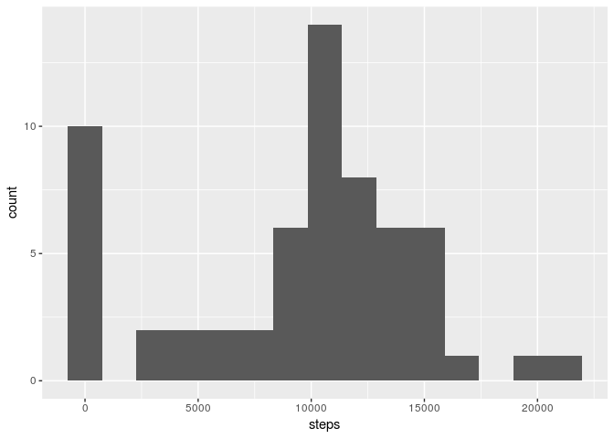
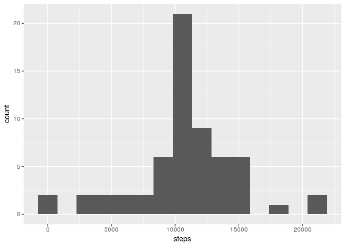

# Reproducible Research: Peer Assessment 1


## Loading and preprocessing the data


```r
library(ggplot2)
library(lubridate, warn.conflicts = FALSE)
library(dplyr, warn.conflicts = FALSE)

unzip("activity.zip")
data <- read.csv("activity.csv")
data$date <- ymd(data$date)
head(data)
```

```
##   steps       date interval
## 1    NA 2012-10-01        0
## 2    NA 2012-10-01        5
## 3    NA 2012-10-01       10
## 4    NA 2012-10-01       15
## 5    NA 2012-10-01       20
## 6    NA 2012-10-01       25
```

## What is mean total number of steps taken per day?


```r
steps_per_day <- data %>%
                 group_by(date) %>%
                 summarise(steps = sum(steps, na.rm = TRUE))
head(steps_per_day)
```

```
## # A tibble: 6 x 2
##         date steps
##       <date> <int>
## 1 2012-10-01     0
## 2 2012-10-02   126
## 3 2012-10-03 11352
## 4 2012-10-04 12116
## 5 2012-10-05 13294
## 6 2012-10-06 15420
```

```r
g <- ggplot(data = steps_per_day, aes(x = steps))
g + geom_histogram(bins = 15) 
```

<!-- -->

```r
### Mean of the total number of steps taken per day
mean(steps_per_day$steps, na.rm = TRUE)
```

```
## [1] 9354.23
```

```r
### Median of the total number of steps taken per day
median(steps_per_day$steps, na.rm = TRUE)
```

```
## [1] 10395
```

## What is the average daily activity pattern?


```r
minute_summarise <- data %>%
                    group_by(interval) %>%
                    summarise(steps = mean(steps, na.rm = TRUE))
ggplot(data = minute_summarise, aes(x = interval, y = steps)) + geom_line()
```

<!-- -->

```r
### 5-minutes interval, that contain the maximum numbers of steps on interval, on average across all days
minute_summarise[[which.max(minute_summarise$steps), "interval"]]
```

```
## [1] 835
```

## Imputing missing values


```r
print("Numbers of NA")
```

```
## [1] "Numbers of NA"
```

```r
sum(is.na(data$steps))
```

```
## [1] 2304
```

```r
sum(is.na(data$date))
```

```
## [1] 0
```

```r
sum(is.na(data$interval))
```

```
## [1] 0
```

```r
### As you can see, only steps column contains NA values
```

As one of the main point is to find the relationship between time and activity(amount of steps), it's better to keep 
mean 5-minutes activities the same. So let's fill NA with mean steps per 5-minutes mean steps


```r
filled_data <- data
na_row <- which(is.na(filled_data$steps))
### Filling na with mean steps(averaged per day)
for(row in na_row){
    filled_data[row, "steps"] = 
        minute_summarise[minute_summarise$interval == filled_data[row, "interval"], "steps"]
}
### Averaged per days

steps_per_day_f <- filled_data %>%
                   group_by(date) %>%
                   summarise(steps = sum(steps))

g <- ggplot(data = steps_per_day_f, aes(x = steps))
g + geom_histogram(bins = 15) 
```

<!-- -->

```r
###Mean

mean(steps_per_day_f$steps)
```

```
## [1] 10766.19
```

```r
### Median

median(steps_per_day_f$steps)
```

```
## [1] 10766.19
```

```r
#### The result is't differ much from data with NA's. Histobram is the same, but has more obervations. Also less 0 because NA was filled
```

## Are there differences in activity patterns between weekdays and weekends?


```r
filled_data <- mutate(filled_data, date_type = factor(wday(date) == 1 | wday(date) == 7, labels = c("weekday", "weekend")))
minute_summarise <- filled_data %>%
                    group_by(date_type, interval) %>%
                    summarise(steps = mean(steps, na.rm = TRUE), )
qplot(interval, steps, data = minute_summarise, geom = "line", facets = date_type ~ .)
```

<!-- -->
